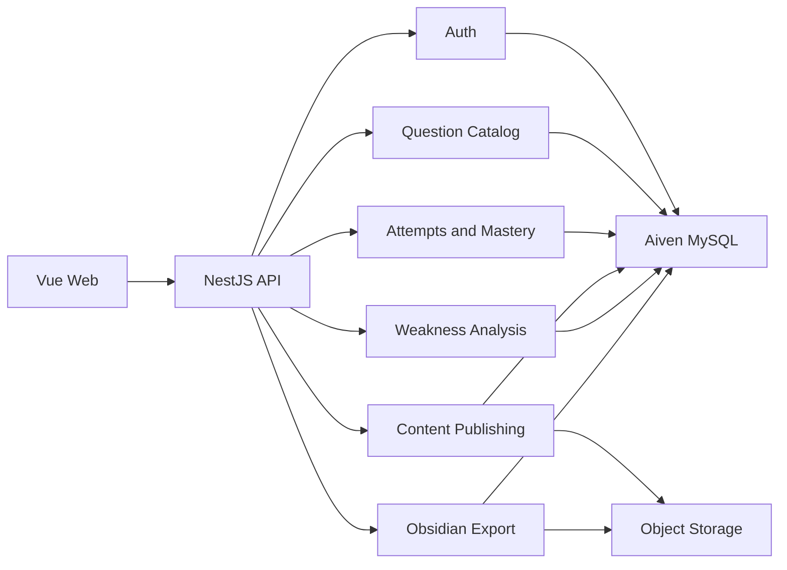

# 考研学习系统规划

> 版本：v0.2，2026-06-14  
> 结论：先完成考研数学 MVP，核心体验是“纸上做题、网站录入、薄弱点分析、Obsidian 复盘”。底层按多学科建模。推荐使用 TypeScript 全栈、Aiven MySQL 和 Cloudflare 域名体系；首版不依赖手写 OCR，也不开发社区、AI 自由问答或复杂推荐算法。

## 1. 产品目标

解决考研复习中真题、答案解析、纸质笔记和错题记录分散的问题，让学生在一个网站完成：

1. 按年份、题号、题型和知识点筛选真题。
2. 在线作答或自行核对后标记“掌握 / 不熟 / 不会”。
3. 查看标准答案与详细解析，稳定渲染数学公式。
4. 自动或手动收录错题，按状态集中复盘。
5. 按高频知识模块训练并查看掌握情况。
6. 完成整张纸质试卷后，在网站录入答案与自评，生成薄弱点分析和 Obsidian 学习包。

首版成功标准不是题库数量最大，而是 3 个闭环可稳定使用：

- 找题到查看解析不超过 3 次操作。
- 做题后状态、错题和历史记录不会丢失。
- 选定的一批数学真题中，公式、图片、答案和解析经人工校对后无展示错误。
- 用户提交整卷后能看到有证据的薄弱模块结论，并下载可直接用 Obsidian 打开的 ZIP。

## 2. MVP 范围与暂不实现内容

### P0：首版必须完成

- 用户注册、登录、退出和基本账户安全。
- 数学真题列表与筛选：年份、题号、卷型、题型、知识点。
- 单题详情：题干、选项、答案、解析、公式和图片。
- 掌握状态：未标记、掌握、不熟、不会。
- 作答记录：结果、用时、作答时间和用户答案。
- 错题本：自动收录做错题目，支持手动加入、移除和筛选。
- 知识点树与知识点专题题目列表。
- 内容导入、校验和发布脚本；至少支持 CSV/JSON 导入。
- 基础管理能力：题目草稿、审核、发布和下线。
- 整卷结果录入：客观题答案、计算题最终答案、证明题完成情况、可选用时与信心等级。
- 薄弱知识点分析：展示证据题目、样本量、置信度和建议复习顺序。
- Obsidian ZIP 导出：试卷报告、错题笔记、知识点笔记、复习计划和薄弱点 Canvas。

### P1：MVP 稳定后实现

- 复习队列、连续学习天数和简单统计面板。
- 按年份整卷练习、计时和交卷。
- 管理后台可视化编辑器。
- 手机端体验专项优化、PWA。
- 邮箱找回密码和运营邮件。

### P2：暂不实现

- AI 自由答疑、手写 OCR 自动判卷、拍照搜题、社交讨论、排行榜。
- 复杂推荐算法、付费体系、原生 App。
- 政治、英语和专业课内容录入。

这些功能会扩大内容审核、成本和合规范围，不值得在核心刷题闭环验证前投入。

## 3. 用户流程与功能设计

### 核心页面

| 页面 | 关键能力 |
|---|---|
| 首页 | 继续上次练习、错题数量、知识点入口 |
| 真题库 | 多条件筛选、年份导航、状态色块 |
| 单题页 | 题干、作答、状态标记、答案解析、上一题/下一题 |
| 错题本 | 按年份、知识点、错误次数和掌握状态筛选 |
| 知识模块 | 知识点树、高频标识、关联真题与掌握概览 |
| 个人中心 | 学习记录、账户设置 |
| 内容管理 | 导入、预览、审核、发布、下线 |
| 整卷录入 | 按题型快速录入答案、自评、用时和信心等级 |
| 分析报告 | 薄弱知识点、证据题目、置信度和建议复习顺序 |
| 导出中心 | 下载 Obsidian ZIP，查看生成历史和导出范围 |

### 状态规则

- `掌握`：用户确认能独立完成。
- `不熟`：会做但过程不稳定，进入近期复习队列。
- `不会`：不能独立完成，优先复习。
- 做错题目自动加入错题本；做对不自动移除，避免一次偶然做对掩盖问题。
- 用户手动将错题标记为掌握后，可从错题本归档，但历史作答永久保留。

### 多学科扩展规则

- 学科是配置和数据，不是复制一套代码。
- 题型使用通用枚举和 `answer_schema`：选择、填空、计算、证明、简答、翻译、作文等。
- 知识点使用树结构，同一题可关联多个知识点。
- 数学公式、英语阅读材料、政治材料题均由通用内容渲染器展示。

### 纸上作答与网站录入流程

```text
选择真题试卷
  -> 在纸上完成试卷
  -> 网站按题号快速录入结果
  -> 系统自动判定客观题，用户自评主观题
  -> 统计引擎计算知识点薄弱度
  -> AI 基于统计证据生成解释与复习建议
  -> 用户下载 Obsidian 学习包
```

不同题型的录入方式：

| 题型 | 用户录入 | 系统能可靠判断的内容 |
|---|---|---|
| 选择题 | 选择选项 | 正误、关联知识点表现 |
| 填空题 | 输入答案 | 在标准化规则可覆盖时自动判定，否则用户确认 |
| 计算题 | 最终答案 + 做题状态 + 可选用时 | 最终结果和用户自评，不能确定中间步骤错误 |
| 证明题 | 做出 / 部分做出 / 空白 + 可选自评 | 完成程度和关联知识点表现，不能判断证明严谨性 |

手写试卷照片可作为用户自己的附件上传，但 MVP 不使用 OCR 自动判分。未来增加 OCR 时，也必须让用户确认识别结果后再进入分析。

用户查看标准解析后，可为错题补充一键错误原因：`概念不清 / 公式忘记 / 思路中断 / 计算失误 / 时间不足 / 其他`。这是用户确认的事实，可用于更具体的复习建议；未选择时，AI 不得自行猜测。

### 分析可信度规则

报告中的内容分为三层：

1. **确定事实**：用户答案、标准答案、正误、用时、自评、关联知识点。
2. **统计推断**：根据多道题和历史记录计算的薄弱知识点、错误频率和复习优先级。
3. **AI 建议**：对统计结果的解释、复习顺序和练习建议。

AI 不得声称“你在某一步求导出错”等没有作答过程证据的结论。样本少于 3 道关联题时，薄弱点必须显示“证据不足”。

## 4. 技术架构

### 推荐技术栈

| 层 | 推荐方案 | 原因 |
|---|---|---|
| 前端 | Vue 3 + TypeScript + Vite | 轻量、成熟，适合独立 SPA 和快速迭代 |
| 状态与请求 | Pinia + TanStack Query | 区分本地 UI 状态和服务端缓存 |
| UI | 选择一个成熟 Vue 组件库后固定使用 | 降低表单、筛选和管理页开发量 |
| 公式 | KaTeX | 渲染快，适合题库静态公式 |
| 后端 | NestJS + TypeScript | 模块化清晰，便于生成 OpenAPI 和代理协作 |
| ORM | Prisma | Schema 可读，迁移和类型生成直接 |
| 数据库 | Aiven MySQL | 满足用户约束，首版免费层可启动 |
| 文件 | Cloudflare R2 或兼容 S3 存储 | 图片不占用 Aiven 的 1 GB 数据库磁盘 |
| 接口 | REST + OpenAPI | 首版简单，便于测试和前后端并行 |
| 部署 | 前端静态托管 + 后端 Docker PaaS/VPS | 前后端独立发布，数据库外置 |

### 仓库建议

```text
kaoyan/
  apps/
    web/             # Vue 前端
    api/             # NestJS 后端
  packages/
    contracts/       # OpenAPI 生成类型或共享 DTO
    content-schema/  # 题目内容与答案 JSON Schema
  prisma/
    schema.prisma
    migrations/
  content/
    imports/         # 待导入数据，不提交受限原始资料
    fixtures/        # 公式与渲染测试样例
  docs/
    adr/             # 关键技术决策
```

这是单仓库中的前后端分离，不等于把前后端耦合在一个进程。统一仓库可减少接口类型漂移，也更适合多个编码代理协作。

### 模块边界



## 5. 数据模型

### 核心表

| 表 | 关键字段与职责 |
|---|---|
| `users` | 用户身份、密码哈希、状态、时间戳 |
| `refresh_tokens` | 刷新令牌哈希、过期和撤销状态 |
| `subjects` | 数学、政治、英语、专业课 |
| `exams` | 考试名称、年份、卷型、科目 |
| `papers` | 试卷元数据、版本和发布状态 |
| `questions` | 通用题型、题号、分值、难度、内容、答案和解析 |
| `question_versions` | 内容版本、来源、变更说明和审核人 |
| `knowledge_points` | 带 `parent_id` 的知识点树 |
| `question_knowledge_points` | 题目与知识点多对多关系 |
| `user_question_states` | 用户对每题的当前掌握状态、错题状态和复习时间 |
| `content_sources` | 内容来源、版权备注和校验状态 |
| `paper_attempts` | 一次整卷作答会话、开始/提交时间、总分与录入方式 |
| `question_attempts` | 每题不可变的结构化答案、完成状态、用时、信心和评价来源 |
| `knowledge_point_snapshots` | 某次分析中各知识点的表现、样本量、薄弱分和置信度 |
| `analysis_reports` | 统计输入版本、AI 模型/提示版本、报告状态和生成时间 |
| `export_jobs` | Obsidian 导出范围、版本、状态、下载地址和过期时间 |
| `attempt_attachments` | 用户手写照片等私有附件的对象存储键、类型和所属作答 |

### 关键字段建议

```text
questions
- id
- paper_id
- sequence_no
- question_type
- stem_markdown
- options_json
- answer_schema_json
- solution_markdown
- status: draft/review/published/archived
- current_version

user_question_states
- user_id + question_id (unique)
- mastery: unmarked/mastered/fuzzy/unknown
- in_wrong_book
- wrong_count
- last_attempt_at
- next_review_at

question_attempts
- paper_attempt_id
- question_id
- submitted_answer_json
- completion: solved/partial/blank
- correctness: correct/incorrect/unknown
- evaluation_source: auto_exact/user_self_assessment/manual_review
- confidence_level: high/medium/low
- error_tags_json
- duration_seconds

knowledge_point_snapshots
- analysis_report_id
- knowledge_point_id
- evidence_question_count
- correct_rate
- completion_rate
- weakness_score
- confidence: high/medium/low/insufficient
```

`question_attempts` 记录历史事实，`user_question_states` 提供快速查询的当前状态。两者不能合并，否则无法同时满足复盘统计和页面性能。

`question_attempts` 由 `paper_attempts` 聚合，也可支持单题练习会话。分析报告必须引用生成时的快照，避免用户后续修改答案导致旧报告无法解释。

## 6. 内容与公式方案

### 内容格式

- 题干和解析保存为受控 Markdown，行内公式使用 `$...$`，块公式使用 `$$...$$`。
- 选项和标准答案保存为结构化 JSON，避免靠字符串拆分。
- 图片保存到对象存储，数据库只保存 URL、尺寸、替代文本和来源。
- 前端使用 KaTeX 渲染，渲染前后均做内容清洗，禁止任意 HTML 和脚本。

### 内容发布流程

```text
原始资料 -> 转写/导入 -> Schema 校验 -> 公式渲染快照 -> 人工核对答案与解析 -> 发布
```

每道题必须保留来源、版本和审核状态。AI 可以承担 OCR 后整理、LaTeX 格式化、JSON 转换和重复项检测，但标准答案与解析必须由人确认。

现有数学真题来源库：

- 数学一：`D:\work\Kaoyan-Math1-Papers`
- 数学二：`D:\work\Kaoyan-Math2-Papers`

两个目录始终只读，代理不能在其中产生任何修改。数学一共观察到 1690 个文件，数学二共观察到 775 个文件，包含 Markdown、PDF、JSON 和大量图片。现有资料存在重复版本、错科目标记、OCR 噪声和授权风险，不能直接批量入库。具体批处理、代理职责和人工审核规则见 `真题内容解析与代理处理规范.md`。

### MVP 内容验收

- 建立至少 30 道“高风险公式样例”，覆盖分式、矩阵、积分、分段函数、上下标、对齐环境和中文混排。
- 在冻结通用内容 Schema 前，加入至少 3 道非数学验证样例：英语阅读、英语作文、政治材料简答。它们不进入数学 MVP 题库，只用于验证长材料、多子题、主观答案和不可自动判分场景。
- 发布前自动检查 Markdown、KaTeX、JSON Schema、图片链接和重复题号。
- 随机抽查加全量公式渲染测试；任何解析修改都创建新版本。

## 7. 部署、域名与安全

### 建议域名结构

| 域名 | 用途 |
|---|---|
| `gongren.xyz` | 前端正式站 |
| `www.gongren.xyz` | 301 跳转到根域名 |
| `api.gongren.xyz` | 后端 API |

当前根域名的两个 A 记录 `63.250.43.18`、`63.250.43.17` 不能视为未来部署目标。确定前端托管平台后，应严格按平台给出的 A/CNAME 和代理要求切换。

必须保留这些邮件记录：

- `gongren.xyz` 的两个 MX。
- `gongren.xyz` 的 SPF TXT。
- `_autodiscover._tcp.gongren.xyz` 的 SRV。

Cloudflare 官方说明 A、AAAA、CNAME 可代理，MX、TXT 等记录始终为 DNS only。域名验证记录和部分 SaaS CNAME 需要保持 DNS only，不能统一打开橙云。

### Aiven 使用边界

截至 2026-06-14，Aiven 免费 MySQL 为单节点、1 CPU、1 GB RAM、1 GB 存储，免费计划无固定到期时间，但长期不活跃可能被关停。它适合 MVP 和内测，不是正式生产高可用方案。

- 后端通过环境变量连接 Aiven，启用 TLS。
- 数据库凭据绝不进入前端、Git 或公开日志。
- 图片不存数据库。
- 每日额外执行逻辑备份到独立存储，并定期验证恢复。
- MVP 默认恢复目标：最多丢失 24 小时数据（RPO 24h），故障后 4 小时内恢复服务（RTO 4h）；正式推广前重新评估。
- 接近 60% 磁盘用量或开始公开推广前，评估付费数据库。

### 安全基线

- 密码使用 Argon2id 哈希；访问令牌短时有效，刷新令牌只保存哈希。
- 刷新令牌放 `HttpOnly + Secure` Cookie；API 限流并记录安全事件。
- 固定允许来源，不使用宽泛 CORS。
- 所有内容输出进行 XSS 清洗。
- 管理接口单独授权，导入文件限制大小和类型。
- 日志不记录密码、令牌、完整用户答案或数据库连接串。
- 手写照片默认私有，使用短期签名 URL；导出包默认不包含照片，用户明确选择后才加入。

## 8. AI 分析与 Obsidian 导出

### 薄弱知识点评分

首版不让 LLM 直接判断薄弱点。后端先根据结构化记录计算：

```text
weakness_score =
  错误率权重
  + 未完成率权重
  + 低信心权重
  + 超时权重
  + 历史重复错误权重
```

具体权重在真实样题和用户测试后确定。每个结论必须附带关联题号、样本数量和置信度；证明题自评和无法自动判定的填空题权重低于自动判定的客观题。

LLM 接收的输入仅包含结构化统计、知识点说明和可引用题号，输出必须通过固定 JSON Schema，再由模板渲染为 Markdown。若 AI 生成失败，系统仍能导出不含 AI 叙述的统计报告。

### Obsidian 导出方案

MVP 生成一个独立 ZIP，用户下载、解压后选择“Open folder as vault”即可使用。推荐目录：

```text
考研数学复盘-2026-06-14/
  00-开始这里.md
  Reports/
    2026-06-14-2025年数学一分析.md
  Knowledge/
    极限.md
    多元函数微分.md
  Mistakes/
    2025-数学一-Q17.md
  Plans/
    未来14天复习计划.md
  Maps/
    薄弱知识点.canvas
  Assets/             # 仅在用户选择包含附件时生成
  manifest.json       # 导出版本与文件校验信息
```

设计规则：

- 所有笔记使用简洁 YAML frontmatter、Obsidian `[[wikilinks]]` 和标准 Markdown/LaTeX。
- `Reports` 是一次分析的事实快照；`Knowledge` 汇总跨试卷知识点；`Mistakes` 保存错题证据；`Plans` 给出可执行复习任务。
- Canvas 只是导航视图，真实结论保存在 Markdown 中。
- 默认只导出用户作答、分析结果、题目元数据和网站题目链接；是否包含完整题干取决于内容授权。
- 每次导出包含稳定 ID 和 `manifest.json`。MVP 每次生成独立 Vault，暂不处理合并到现有 Vault 的冲突。
- 后续可增加 Obsidian 插件或增量导入器，但必须在 ZIP 导出稳定后再做。

完整设计和示例见 `Obsidian学习分析导出设计.md` 与 `obsidian-export-example/`。

## 9. 开发阶段与验收标准

### 建议里程碑

| 阶段 | 预计投入 | 交付与验收 |
|---|---:|---|
| M0 决策与样例 | 2-3 天 | 确定技术栈、题目 Schema、20 道真实样题和版权边界 |
| M1 工程骨架 | 3-5 天 | 前后端启动、CI、迁移、健康检查、开发环境 |
| M2 真题与解析 | 5-8 天 | 筛选、单题页、内容导入、KaTeX 渲染测试 |
| M3 学习闭环 | 5-8 天 | 登录、作答、掌握状态、错题本、历史记录 |
| M4 分析与 Obsidian 导出 | 5-8 天 | 整卷录入、薄弱点快照、AI 解释、ZIP 与 Canvas |
| M5 知识模块与内容管理 | 5-8 天 | 知识点树、专题页、审核发布流程 |
| M6 上线 | 3-5 天 | Aiven、对象存储、域名、TLS、备份和冒烟测试 |

这是单人主导并使用编码代理的粗略计划。最大变量不是页面开发，而是真题内容整理、版权确认和人工校对。

### 上线门槛

- P0 用户流程通过端到端测试。
- 选定发布题库经过人工校对，有来源和审核记录。
- 公式测试集全部通过，手机和桌面端无明显溢出。
- 登录、越权、XSS、CORS、限流和备份恢复完成验证。
- DNS 切换前导出现有记录、准备回滚值并降低 TTL；切换后分别验证网站、API 和邮箱。
- 同一份作答数据重复生成报告时，统计结论一致；AI 不得输出无证据的步骤错误。
- 导出 ZIP 解压后可被 Obsidian 直接打开，所有 wikilink 和 Canvas 文件节点有效。

## 10. 多代理任务分工

### 主负责人 / Codex 负责困难部分

- 定义产品边界、题目内容 Schema、数据库模型和模块接口。
- 设计作答历史与当前掌握状态的一致性规则。
- 实现或审查认证、安全、内容清洗、公式渲染和发布流程。
- 决定迁移策略、部署拓扑、DNS 切换和备份恢复方案。
- 定义薄弱度评分、证据等级、AI 输出 Schema 和 Obsidian 导出契约。
- 审查代理提交，处理跨模块集成、性能和安全缺陷。

### Claude Code 适合承担

- 按既定目录和规范生成前后端脚手架。
- 实现明确接口下的 CRUD、列表筛选、表单和常规页面。
- 编写 Prisma migration、seed、OpenAPI 客户端和 Dockerfile。
- 根据验收标准补单元测试、API 集成测试和 E2E 测试。
- 修复 lint、类型错误、重复代码和常规 UI 问题。

### DeepSeek 4 Pro 适合承担

- 把经过授权的原始题目批量转换为指定 JSON/Markdown/LaTeX 格式。
- 生成导入失败报告、重复题检测规则和公式测试样例草稿。
- 根据固定模板补充测试用例、接口示例和操作文档。
- 基于脱敏结构化数据生成 AI 分析回归样例，并标出无证据推断。
- 对批量内容做初筛，但不能决定或发布标准答案。

### 任务包规则

给其他代理的每个任务必须包含：

```text
目标：
允许修改的文件：
禁止修改的文件：
输入与接口契约：
验收标准：
必须运行的命令：
输出格式：
```

任务应控制在半天到一天内可完成，并要求代理提交变更摘要和测试结果。不要让多个代理同时修改认证、数据库 Schema 或共享内容 Schema。

## 11. 风险、决策点与下一步

### P0 风险

1. **内容版权与准确性**：上线前确认真题、答案和解析的使用权；AI 生成解析不能直接作为标准答案发布。
2. **数据模型过早绑定数学**：表和接口必须使用 `subject/question/knowledge_point` 等通用概念。
3. **免费数据库限制**：1 GB 和单节点只适合 MVP，必须可迁移并保留独立备份。
4. **公式与内容安全**：LaTeX 渲染正确不等于内容安全，必须限制 Markdown/HTML 能力并做 XSS 清洗。
5. **分析越界**：只有最终答案和自评时，系统不能可靠诊断具体步骤错误；报告必须展示证据和置信度。
6. **Obsidian 合并冲突**：MVP 只导出独立 Vault ZIP，不直接修改用户已有 Vault。

### 启动开发前需要人决定的 4 件事

1. 首批上线哪些年份、卷型，以及是否拥有可公开使用的题目与解析来源。
2. 是否采用推荐的 Vue 3 + NestJS TypeScript 全栈。
3. 登录首版使用邮箱密码，还是增加第三方登录。
4. 后端部署使用 Docker PaaS 还是自有 VPS；选择后才能给出准确 DNS 记录。

### 推荐启动顺序

先准备 20 道覆盖不同题型和复杂公式的真实样题，确认内容 Schema 与渲染方案；随后初始化仓库和工程骨架。不要先批量导入数千道题，否则内容格式一旦调整，返工成本会非常高。

### 已核验来源

- [Aiven 免费 MySQL](https://aiven.io/free-mysql-database)
- [Aiven 免费计划规格与限制](https://aiven.io/pricing)
- [Cloudflare DNS Proxy 状态](https://developers.cloudflare.com/dns/proxy-status/)
